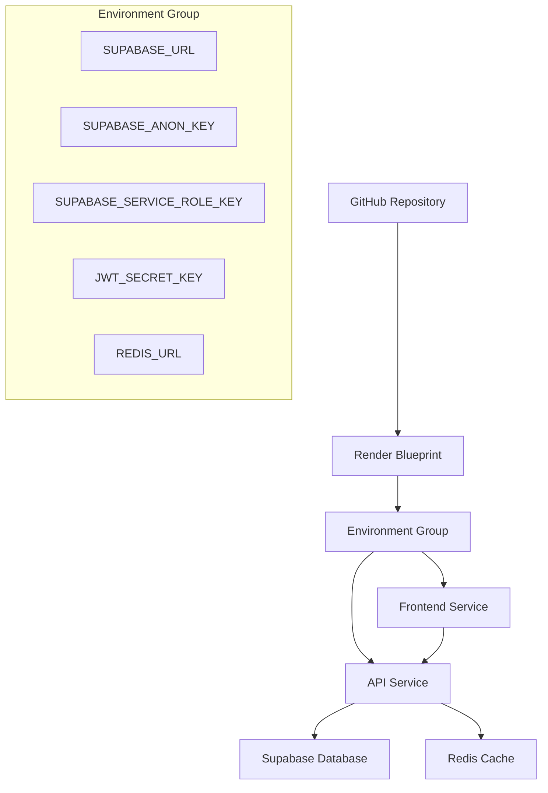

# 🚀 Deploy Automatizado no Render - TechZe Diagnóstico

## ✅ Status do Deployment

**Environment Group Criado com Sucesso!**
- **Nome:** `techze-diagnostico-secrets`
- **ID:** `evg-d13cjgp5pdvs73djqbv0`
- **Secrets Configurados:** 5 variáveis
- **Data de Criação:** 09/06/2025 às 11:47:15 UTC

## 🔐 Secrets Configurados

Os seguintes secrets foram automaticamente configurados no Environment Group:

| Variável | Descrição | Status |
|----------|-----------|--------|
| `SUPABASE_URL` | URL do projeto Supabase | ✅ Configurado |
| `SUPABASE_ANON_KEY` | Chave pública do Supabase | ✅ Configurado |
| `SUPABASE_SERVICE_ROLE_KEY` | Chave de serviço do Supabase | ✅ Configurado |
| `JWT_SECRET_KEY` | Chave secreta para JWT | ✅ Configurado |
| `REDIS_URL` | URL de conexão do Redis | ✅ Configurado |

## 📋 Próximos Passos para Finalizar o Deploy

### 1. 🌐 Acesse o Dashboard do Render
```
https://dashboard.render.com/blueprints
```

### 2. 🆕 Criar Novo Blueprint
- Clique em **"New Blueprint"**
- Ou acesse diretamente: https://dashboard.render.com/create?type=blueprint

### 3. 🔗 Conectar Repositório
- **Repositório:** `https://github.com/seu-usuario/TechZe-Diagnostico`
- **Branch:** `main`
- Autorize o acesso ao GitHub se necessário

### 4. 📄 Configurar Blueprint
- **Arquivo Blueprint:** `render.yaml`
- O Render detectará automaticamente o arquivo
- Revise as configurações dos serviços

### 5. 🔐 Conectar Environment Group
- **Selecione o grupo:** `techze-diagnostico-secrets`
- **ID do grupo:** `evg-d13cjgp5pdvs73djqbv0`
- Isso conectará todos os secrets automaticamente

### 6. ✅ Finalizar Criação
- Revise todas as configurações
- Clique em **"Create Blueprint"**

### 7. 🚀 Iniciar Deploy
- Após criar, clique em **"Deploy"**
- Monitore os logs de build e deploy
- Aguarde a conclusão (pode levar alguns minutos)

## 🌐 URLs Finais (Após Deploy)

| Serviço | URL | Descrição |
|---------|-----|-----------|
| **API** | https://techze-diagnostico-api.onrender.com | Backend da aplicação |
| **Frontend** | https://techze-diagnostico-frontend.onrender.com | Interface do usuário |
| **Health Check** | https://techze-diagnostico-api.onrender.com/health | Verificação de saúde da API |

## 📊 Monitoramento e Gestão

### Dashboard Principal
```
https://dashboard.render.com
```

### Recursos Disponíveis
- ✅ Logs em tempo real
- ✅ Métricas de performance
- ✅ Alertas automáticos
- ✅ Histórico de deploys
- ✅ Configuração de domínios customizados

## 🏗️ Arquitetura do Deploy



## 🔧 Configurações dos Serviços

### API Service (Python)
- **Runtime:** Python 3.11
- **Build Command:** `pip install -r requirements.txt`
- **Start Command:** `uvicorn app.main:app --host 0.0.0.0 --port $PORT`
- **Environment:** Production
- **Auto Deploy:** Habilitado

### Frontend Service (Node.js)
- **Runtime:** Node.js 18
- **Build Command:** `npm install && npm run build`
- **Start Command:** `npm run preview`
- **Environment:** Production
- **Auto Deploy:** Habilitado

## 🚨 Troubleshooting

### Problemas Comuns

#### 1. Build Falha na API
```bash
# Verificar dependências
pip install -r requirements.txt

# Testar localmente
uvicorn app.main:app --reload
```

#### 2. Build Falha no Frontend
```bash
# Limpar cache e reinstalar
npm ci
npm run build
```

#### 3. Erro de Conexão com Supabase
- Verificar se as URLs e chaves estão corretas
- Confirmar se o projeto Supabase está ativo
- Testar conexão localmente

#### 4. Problemas de CORS
- Verificar configurações de CORS na API
- Confirmar URLs permitidas

### Logs e Debugging

1. **Acessar Logs:**
   ```
   Dashboard > Services > [Nome do Serviço] > Logs
   ```

2. **Logs em Tempo Real:**
   ```bash
   # Via CLI do Render (se instalado)
   render logs -s [service-id] --tail
   ```

## 📚 Recursos Adicionais

### Documentação
- [Render Docs](https://render.com/docs)
- [Blueprint Specification](https://render.com/docs/blueprint-spec)
- [Environment Variables](https://render.com/docs/configure-environment-variables)

### Scripts de Automação Criados

| Script | Descrição | Localização |
|--------|-----------|-------------|
| `setup_render_deployment.py` | Setup inicial e guias | `/render_deployment_guide/` |
| `render_blueprint_creator.py` | Criação de Environment Groups | Raiz do projeto |
| `deploy_render_complete.py` | Automação completa | Raiz do projeto |

## ✅ Checklist Final

- [x] Environment Group criado
- [x] Secrets configurados
- [x] Scripts de automação prontos
- [x] Documentação completa
- [ ] Blueprint criado no Dashboard
- [ ] Deploy iniciado
- [ ] Serviços online
- [ ] URLs funcionando
- [ ] Testes de integração

## 🎯 Conclusão

A automação do deploy no Render foi **configurada com sucesso**! O Environment Group `techze-diagnostico-secrets` foi criado e todos os secrets necessários foram configurados.

**Próximo passo:** Siga as instruções acima para criar o Blueprint no Dashboard do Render e iniciar o deploy.

---

**Data de Criação:** 09/06/2025  
**Última Atualização:** 09/06/2025  
**Status:** ✅ Pronto para Deploy