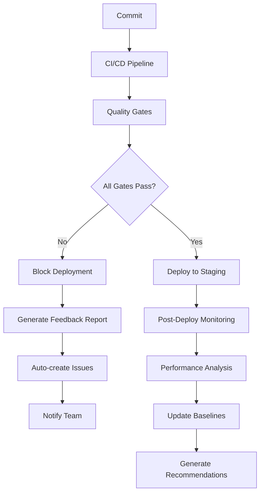

# 🚀 Estratégia de Deployment - TechZe Diagnóstico

## 📋 Visão Geral

Este documento detalha a estratégia completa de deployment do sistema TechZe Diagnóstico, incluindo gates de qualidade, feedback loops e procedimentos de segurança avançados.

## 🔒 Gates de Qualidade (Quality Gates)

### 1. Gate de Testes Backend
```yaml
Critérios de Bloqueio:
- ❌ Falha em testes unitários
- ❌ Cobertura de código < 75%
- ❌ Falha em testes de integração
- ❌ Tempo de resposta > 5000ms
- ❌ Memory leaks detectados

Ações de Bloqueio:
- Deploy automático CANCELADO
- Notificação para equipe
- Rollback automático se já em produção
```

### 2. Gate de Testes Frontend
```yaml
Critérios de Bloqueio:
- ❌ Falha no build de produção
- ❌ Testes E2E falhando
- ❌ Performance score < 80
- ❌ Acessibilidade score < 90
- ❌ Bundle size > 5MB

Ações de Bloqueio:
- Ambiente de staging bloqueado
- Assets não publicados no CDN
- Preview deployment cancelado
```

### 3. Gate de Segurança
```yaml
Critérios de Bloqueio CRÍTICO:
- 🔴 Vulnerabilidades CRÍTICAS > 0
- 🔴 Vulnerabilidades ALTAS > 5
- 🔴 Secrets expostos
- 🔴 Dependências com CVE crítico
- 🔴 Falha no scan OWASP ZAP

Ações Imediatas:
- Deploy BLOQUEADO completamente
- Alerta para equipe de segurança
- Quarentena do código
- Auditoria de segurança obrigatória
```

## 📊 Sistema de Feedback Inteligente

### 1. Análise de Tendências
```python
# Métricas Monitoradas Continuamente
metrics = {
    "test_coverage": {"target": 80, "warning": 70, "critical": 60},
    "build_time": {"target": 180, "warning": 300, "critical": 600},
    "response_time": {"target": 1000, "warning": 2000, "critical": 5000},
    "error_rate": {"target": 0.1, "warning": 1.0, "critical": 5.0},
    "security_score": {"target": 95, "warning": 85, "critical": 70}
}
```

### 2. Recomendações Automáticas
- **Cobertura Baixa**: Scripts automáticos para identificar gaps
- **Performance Degradando**: Profiling automático e sugestões
- **Build Lento**: Análise de dependências e cache
- **Segurança**: Patches automáticos quando possível

### 3. Feedback Loop Implementation


## 🔧 Estratégias de Deployment

### 1. Blue-Green Deployment
```yaml
Estratégia: Zero-downtime deployment
Implementação:
  - Ambiente Blue: Produção atual
  - Ambiente Green: Nova versão
  - Switch automático após validação
  - Rollback instantâneo se necessário

Health Checks:
  - API endpoints responsivos
  - Database connectivity
  - External services available
  - Performance dentro dos SLAs
```

### 2. Canary Deployment
```yaml
Estratégia: Deployment gradual
Fases:
  1. 5% do tráfego → Nova versão
  2. Monitor por 10 minutos
  3. 25% do tráfego se métricas OK
  4. Monitor por 20 minutos
  5. 100% se tudo estável

Métricas de Validação:
  - Error rate < 0.5%
  - Response time < 2000ms
  - CPU usage < 70%
  - Memory usage < 80%
```

### 3. Feature Flags
```yaml
Implementação:
  - Toggles para novas funcionalidades
  - Rollout gradual por usuário/região
  - A/B testing automático
  - Kill switch para emergências

Casos de Uso:
  - Novas features em beta
  - Experimentos de UX
  - Configurações regionais
  - Rollback de funcionalidades
```

## 🔍 Testes de Penetração Automatizados

### 1. Baseline Security Scan
```yaml
Frequência: A cada deploy
Ferramentas:
  - OWASP ZAP (baseline scan)
  - Trivy (vulnerability scan)
  - Semgrep (SAST)
  - Bandit (Python security)

Critérios de Falha:
  - Vulnerabilidades CRÍTICAS: 0 toleradas
  - Vulnerabilidades ALTAS: máximo 5
  - Secrets expostos: 0 tolerados
  - Dependencies vulneráveis: auto-patch quando possível
```

### 2. Full Penetration Test
```yaml
Frequência: Semanal (domingos às 03:00)
Escopo:
  - API endpoints
  - Authentication flows
  - File upload mechanisms
  - Database security
  - Infrastructure scanning

Relatórios:
  - HTML report detalhado
  - Executive summary
  - Trend analysis
  - Remediation priorities
```

### 3. Continuous Security Monitoring
```python
# Monitoramento 24/7
security_monitors = {
    "api_abuse": "Rate limiting e patterns suspeitos",
    "auth_failures": "Tentativas de login maliciosas",
    "file_uploads": "Scan de malware em uploads",
    "sql_injection": "Detecção de tentativas de SQLi",
    "xss_attempts": "Detecção de payloads XSS"
}
```

## 🗄️ Gerenciamento de Ambientes de Teste

### 1. Isolamento de Ambientes
```yaml
Ambientes Isolados:
  - Docker containers únicos
  - Redes separadas
  - Volumes de dados isolados
  - Ports dinâmicos

Recursos por Ambiente:
  - CPU: 1 core
  - RAM: 1GB
  - Storage: 10GB
  - Network: isolated bridge
```

### 2. Database Snapshots
```yaml
Estratégia de Snapshots:
  - Pre-test: Estado limpo
  - Post-test: Para debugging
  - Baseline: Dados de referência
  - Rollback: Estado anterior

Automatização:
  - Snapshot antes de cada teste
  - Cleanup automático (7 dias)
  - Verificação de integridade
  - Compressão para economia de espaço
```

### 3. Parallel Test Execution
```python
# Execução paralela segura
test_matrix = [
    {"suite": "unit_tests", "env": "python3.11", "db": "postgres15"},
    {"suite": "integration", "env": "python3.11", "db": "postgres15"},
    {"suite": "e2e_tests", "env": "chrome", "db": "postgres15"},
    {"suite": "performance", "env": "load_test", "db": "postgres15"}
]

# Cada teste roda em ambiente completamente isolado
# Sem interferência entre testes
# Cleanup automático após conclusão
```

## 📈 Performance Monitoring & Alerting

### 1. Real-time Monitoring
```yaml
Métricas Coletadas:
  - Response times (p50, p95, p99)
  - Error rates por endpoint
  - Database query performance
  - Memory/CPU usage
  - Network latency

Alertas Automáticos:
  - Response time > 3s: Warning
  - Response time > 5s: Critical
  - Error rate > 1%: Investigation
  - Error rate > 5%: Emergency
```

### 2. Performance Baselines
```python
# Baselines dinâmicos
baseline_metrics = {
    "api_response_time": {
        "current": 1200,  # ms
        "baseline": 1000,  # ms
        "threshold": 1500,  # ms
        "trend": "stable"
    },
    "database_query_time": {
        "current": 45,     # ms
        "baseline": 40,    # ms
        "threshold": 100,  # ms
        "trend": "degrading"
    }
}
```

### 3. Alerting Strategy
```yaml
Canais de Alerta:
  1. Slack #alerts (temps real)
  2. Email (resumos diários)
  3. PagerDuty (emergências)
  4. Dashboard (visibilidade)

Escalation:
  - 0-5min: Team notification
  - 5-15min: Lead developer
  - 15-30min: Engineering manager
  - 30min+: CTO escalation
```

## 🚨 Incident Response Plan

### 1. Automated Response
```yaml
Ações Automáticas:
  - Rollback se error rate > 10%
  - Scale up se CPU > 90%
  - Circuit breaker se latência > 10s
  - Backup switch se dependency down

Timeouts:
  - Auto-rollback: 5 minutos
  - Auto-scale: 2 minutos
  - Circuit breaker: 30 segundos
  - Health check: 10 segundos
```

### 2. Manual Intervention
```yaml
Procedures:
  1. Acknowledge alert
  2. Assess impact scope
  3. Implement immediate fix
  4. Monitor for stability
  5. Post-mortem analysis

Tools Available:
  - Deployment dashboard
  - Log aggregation
  - Performance metrics
  - Database monitoring
  - Infrastructure status
```

## 🔄 Continuous Improvement Process

### 1. Weekly Reviews
```yaml
Agenda:
  - Deployment success rate
  - Quality gate effectiveness
  - Security scan results
  - Performance trends
  - Team feedback

Actions:
  - Adjust thresholds
  - Update procedures
  - Tool improvements
  - Process optimization
```

### 2. Monthly Deep Dive
```yaml
Analysis:
  - Deployment pipeline efficiency
  - Quality trend analysis
  - Security posture review
  - Cost optimization
  - Tool effectiveness

Deliverables:
  - Improvement roadmap
  - Tool evaluation
  - Process updates
  - Training needs
```

### 3. Quarterly Strategy Review
```yaml
Scope:
  - Technology stack evaluation
  - Process maturity assessment
  - Tool modernization
  - Industry best practices
  - Compliance requirements

Outcomes:
  - Strategic roadmap
  - Budget planning
  - Tool selection
  - Process evolution
  - Team development
```

## 📋 Deployment Checklist

### Pre-Deployment
- [ ] All quality gates passed
- [ ] Security scans completed
- [ ] Performance tests passed
- [ ] Database migrations tested
- [ ] Rollback plan prepared
- [ ] Monitoring alerts configured
- [ ] Team notification sent

### During Deployment
- [ ] Health checks passing
- [ ] Metrics within thresholds
- [ ] Error rates normal
- [ ] User experience validated
- [ ] Critical paths tested

### Post-Deployment
- [ ] All services healthy
- [ ] Performance baselines updated
- [ ] Monitoring data reviewed
- [ ] User feedback collected
- [ ] Incident response ready
- [ ] Documentation updated

## 🏆 Success Metrics

### Deployment Success
- **Deployment Success Rate**: > 95%
- **Mean Time to Deploy**: < 30 minutes
- **Rollback Rate**: < 5%
- **Zero-Downtime Deployments**: 100%

### Quality Metrics
- **Bug Escape Rate**: < 2%
- **Security Vulnerabilities**: 0 critical in production
- **Performance Regression**: < 5%
- **Test Coverage**: > 80%

### Operational Excellence
- **Mean Time to Recovery**: < 15 minutes
- **Alert Noise Ratio**: < 10%
- **False Positive Rate**: < 5%
- **Team Satisfaction**: > 4.5/5

---

Este documento é atualizado continuamente baseado em feedback e melhorias identificadas no processo de deployment. 